# Do_an_ca_nhan_AI-Nguyễn Hoàng Anh Kiệt-23110247
### 1.Mục tiêu  
- Hiểu rõ được bản chất và nguyên lí các thuật toán tìm kiếm AI
- Áp dụng được các thuật toán đã học vào vấn đề thực tế (áp dụng thuật toán, tạo giao diện cho trò chơi 8 Puzzle)
- So sánh, đánh giá ưu nhược điểm của từng (nhóm) thuật toán
- Có thể đưa ra giải pháp nâng cấp(nếu có)
### 2. Nội dung   
  ### 2.1. Các thuật toán Tìm kiếm không có thông tin  
     - Mô tả:là nhóm thuật toán không ưu tiên bất kì trạng thái nào, mở rộng nút theo thứ tự nhất định
     - Thành phần chính: ma trận đầu vào, ma trận đầu ra, thuật toán áp dụng, tập các hành động sinh trạng thái mới
     - Solution: tập các trạng thái mới được sinh ra đại diện cho từng bước giải trò chơi
### 📊 Thuật toán BFS  
> Tìm kiếm bằng cách duyệt theo chiều rộng(duyệt từng lớp) các trạng thái được sinh ra
> 

>   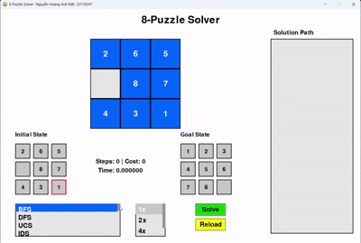
> 

### 📊 Thuật toán DFS  
> Duyệt theo chiều sâu, duyệt cho tới cuối nhánh của không gian trạng thái
> 

>   
> 

### 📊 Thuật toán IDS  
> Sử dụng DfS nhưng có giới hạn dộ sâu -> tối ưu hơn về mặc thời gian và hiệu suất
> 

>   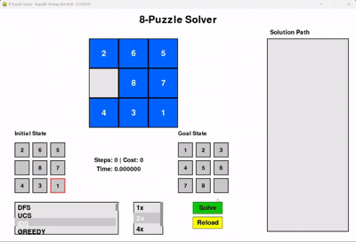
> 

### 📊 Thuật toán UCS  
> Duyệt theo tổng chi phí đường đi (là 1 tương ứng với mỗi step
> 

>   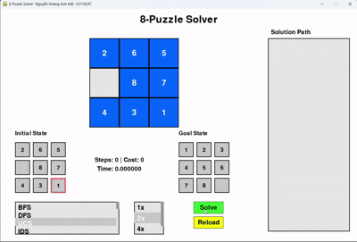
> 
  
### 🚀 So sánh hiệu suất

  <strong>Số bước</strong> 
  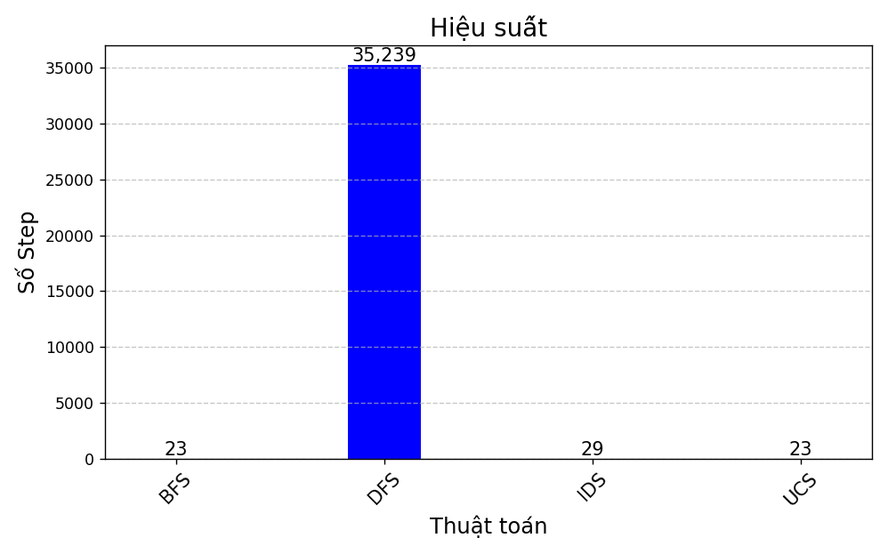  
  <strong>Thời gian giải</strong> 
  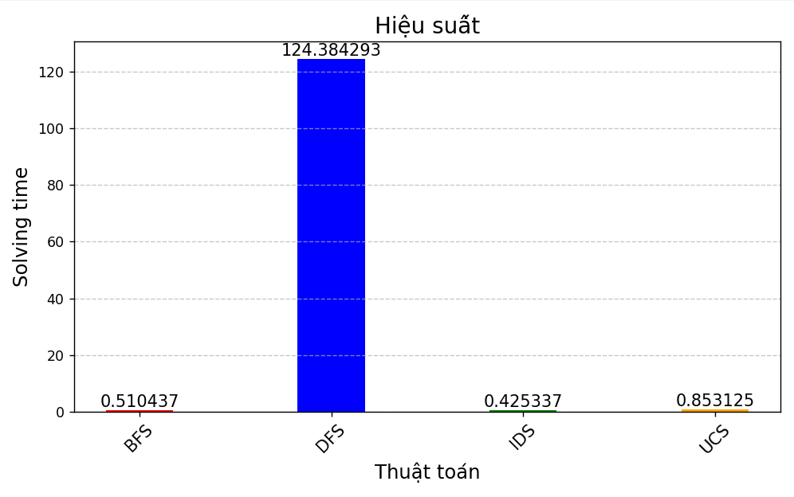

 ### 2.2. Các thuật toán Tìm kiếm có thông tin  
     - Mô tả: tìm kiếm dựa vào đánh giá, ước lượng chi phí (Heurictic)
     - Thành phần chính: ma trận đầu vào, ma trận đầu ra, thuật toán áp dụng, tập các hành động sinh trạng thái mới
     - Solution: tập các trạng thái mới được sinh ra đại diện cho từng bước giải trò chơi
### 📊 Thuật toán GREEDY  
> Dựa vào chi phí Heurictic (cụ thể là Manhatan được dùng trong mã nguồn) thấp nhất để đưa ra hành động
> 

>   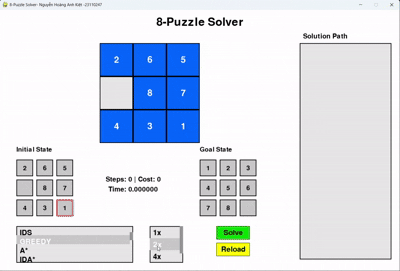
> 
 
### 📊 Thuật toán A*  
> Dựa vào chi phí g(n): chi phí thực tế (tương ứng với step trong trạng thái hiện tại của curent_state) và h(n): heurictic để xác định trạng thái cần mở rộng
> 

>   
> 
  
### 📊 Thuật toán IDA*  
> Tương tự A*, nhưng có thiết lập chiều sâu, tối ưu hơn về vùng nhớ, hiệu năng tìm kiếm, thuật toán sẽ luôn tìm thấy lời giải nếu có tồn tại
> 

>   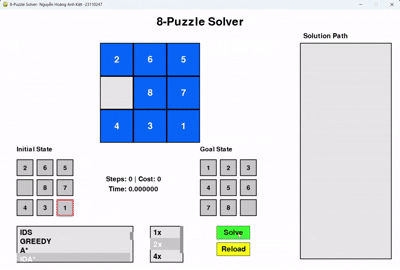
> 
  
### 🚀 So sánh hiệu suất

  <strong>Số bước</strong> 
  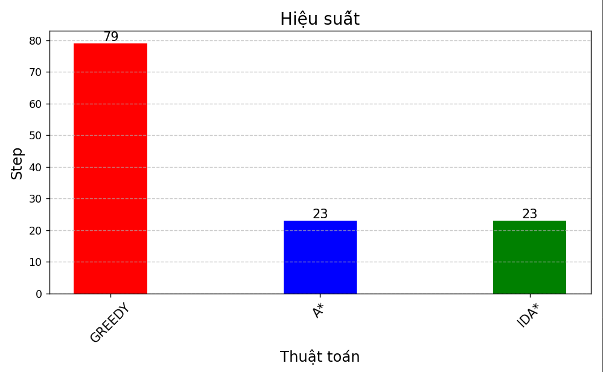  
  <strong>Thời gian giải</strong> 
  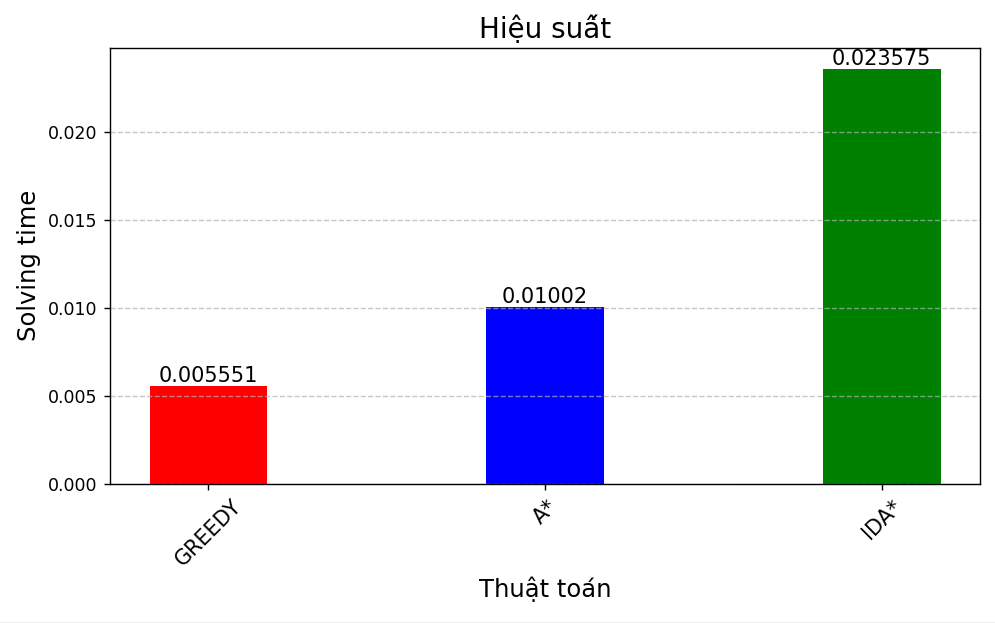

  

 ###   2.3. Các thuật toán Tìm kiếm cục bộ  
      - Mô tả: 
            + Thuật toán tìm kiếm cục bộ từ bỏ việc khám phá không gian tìm kiếm một cách có hệ thống 
            + Thay vì cố gắng truy cập tất cả các trạng thái, tìm kiếm cục bộ sử dụng các chiến lược để tìm ra các trạng thái khá tốt một cách nhanh chóng trung bình.
            + Nhược điểm của lựa chọn thiết kế này là tìm kiếm cục bộ không được đảm bảo sẽ tìm ra giải pháp ngay cả khi có giải pháp. 
      - Thành phần chính: trạng thái đầu vào hợp lệ, một tập các quan hệ láng giềng, một hàm chi phí đánh giá chất lượng, một trạng thái địch
      - Solution: Một đường dẫn tù trạng thái ban đầu đến trạng thái đích(có thể rỗng).  
### 📊 Thuật toán SIMPLE HILL  
> Leo đồi đơn giản là một biến thể đơn giản của trò chơi leo đồi, trong đó thuật toán sẽ đánh giá từng nút lân cận và chọn nút đầu tiên có cải tiến hơn nút hiện tại.
> 

>   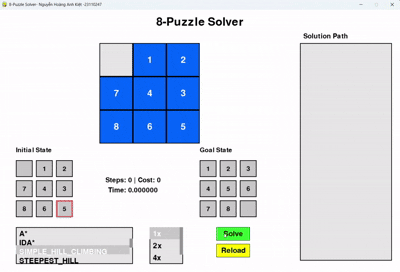
> 
  
### 📊 Thuật toán STEPEST HILL  
> Leo đồi dốc nhất là phiên bản nâng cao của leo đồi đơn giản. Thay vì di chuyển đến nút lân cận đầu tiên cải thiện trạng thái, nó sẽ đánh giá tất cả các nút lân cận và di chuyển đến nút cung cấp cải thiện cao nhất (độ dốc cao nhất).
> 

>   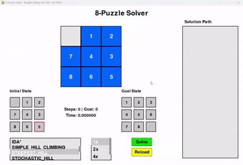
> 
 
### 📊 Thuật toán STOCHASTIC HILL  
> Dưa tính ngẫu nhiên vào quá trình tìm kiếm. Thay vì đánh giá tất cả các nút lân cận hoặc chọn cải tiến đầu tiên, nó chọn một nút lân cận ngẫu nhiên và quyết định có di chuyển dựa trên cải tiến của nó so với trạng thái hiện tại hay không.
> 

>   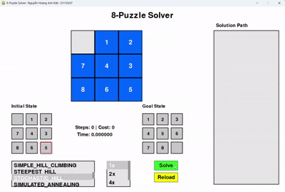
> 
  
### 📊 Thuật toán SIMULATED_ANNEALING  
> Được lấy cảm hứng từ quá trình ủ trong luyện kim, trong đó vật liệu được nung nóng và sau đó làm nguội dần để loại bỏ khuyết tật. Nó cho phép thỉnh thoảng di chuyển đến các giải pháp tệ hơn để thoát khỏi tối ưu cục bộ, với khả năng các di chuyển như vậy giảm dần theo thời gian.
> 

>   
> 
 
### 📊 Thuật toán BEAM Search  
> Là một biến thể của tìm kiếm cục bộ duy trì nhiều trạng thái (hoặc chùm tia) ở mỗi cấp độ tìm kiếm. Nó khám phá nhiều đường dẫn cùng lúc, nhằm mục đích tăng khả năng tìm ra giải pháp tốt.
> 

>   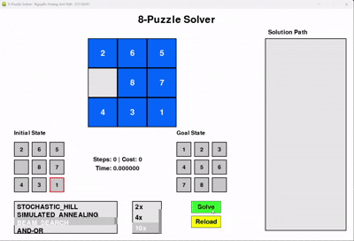
> 
  
### 📊 Thuật toán GENETIC  
> Được lấy cảm hứng từ quá trình chọn lọc tự nhiên và tiến hóa. Họ làm việc với một quần thể các giải pháp và phát triển chúng theo thời gian bằng cách sử dụng các toán tử di truyền như chọn lọc, lai ghép và đột biến.
> 

>   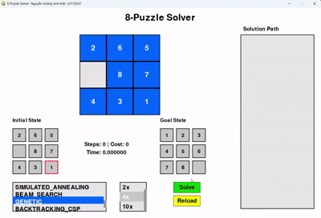
> 
 
### Đánh giá hiệu suất  
- Các thuật toán leo đổi chỉ tìm được lời giải cho những tastcase đơn giản trong quá trình kiểm thử, hiệu suất nhận thấy gần như tương đương.
- Các thuật toán còn lại:

  <strong>Số bước</strong> 
  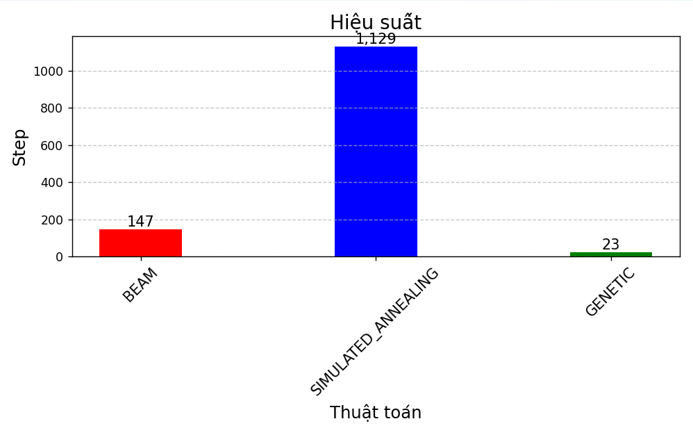  
  <strong>Thời gian giải</strong> 
  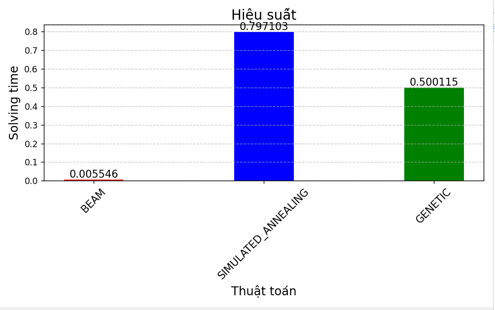

  

  
 ###   2.4. Các thuật toán Tìm kiếm trong môi trường phức tạp  
      - Mô tả: Tìm kiếm trong môi trường phức tạp, trong đó nhận thức của tác nhân không đủ để xác định trạng thái chính xác. Điều đó có nghĩa là một số hành động của tác nhân sẽ nhằm mục đích giảm bớt sự không chắc chắn về trạng thái hiện tại.
      - Thành phần chính: tập các trạng thái niềm tin, tập các hành động áp dụng, tập các trạng thái đích
      - Solution: áp dụng các hành động lên trạng thái niềm tin làm giảm bớt các trạng thái không phù hợp, đồng thời đưa các trạng thái lại cần với trạng thái đích.  
### Các trạng thái niềm tin trong nhóm thuật toán này được tạo ra dựa trên trạng thái đích đồng thời tạo ra với số lượng cần thiết để có thể tìm ra tập hành động phù hợp.
### 📊 Thuật toán And-Or  
> Bài toán And_Or được dùng để giải quyết các bài toán có tính không xác định (non-deterministic). Tuy nhiên, vẫn chưa triển khai được trong môi trường niềm tin. Hiện tại được áp dụng trên trạng thái xác định. 
> 

>   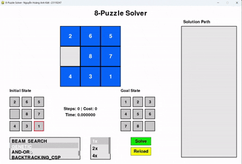
> 
  
### 📊 Thuật toán Non Observation  
> Giải pháp cho một vấn đề không có cảm biến là một chuỗi hành động, không phải là một kế hoạch có điều kiện (vì không có nhận thức).
> Nhưng chúng ta tìm kiếm trong không gian của các trạng thái niềm tin thay vì các trạng thái vật lý.  
> Trong không gian trạng thái niềm tin, vấn đề có thể quan sát được hoàn toàn vì tác nhân luôn biết trạng thái niềm tin của chính mình. Hơn nữa, giải pháp (nếu có) cho một vấn đề không có cảm biến.
> Tập hành động được phân tích dựa trên chi phí Heurictic giữa các trạng thái trong tập niềm tin. Vì thế các hành động có thể làm cho tập niềm tin rỗng hoặc rơi vào vòng lặp các hành động lặp đi lặp lại vì thế bài toán không phải luôn có đáp án.
> 

>   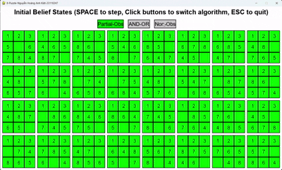
> 
  
### 📊 Thuật toán Partial Observation  
> Nếu trong tìm kiếm không có cảm biến khi áp dụng trong bài toán 8 Puzzle là không khả thi, nhưng có thể giải nếu chúng ta có thể nhìn thấy được thông tin một phần của ma trận thì cũng đủ để lần lượt đưa các ô vào vị trí đúng bằng cách theo dõi và ghi nhớ hành động (tức là duy trì trạng thái niềm tin).
> Từ đó quan sát lặp kế hoạch cho hành động dựa trên chi phí Heurictic. 
> 

>   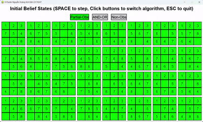
> 
 
### 2.5. Các thuật toán Tìm kiếm có ràng buộc  
    - Mô tả: sử dụng ràng buộc để giải bài toán 8 Puzzle
    - Thành phần chính: Một tập hữu hạn các biến X (trong trò chơi là trạng thái rỗng), miền giá trị (một tập hữu hạn các giá trị) cho mỗi biến (có thể hiểu là goal_state), một tập hữu hạn các ràng buộc C  
    - Solutinon:  là một phép gán đầy đủ các giá trị của các biến sao cho thỏa mãn tất cả các ràng buộc.
### 📊 Thuật toán Backtracking  
> Dựa trên giải thuật tìm kiếm theo chiều sâu (depth-first search). Mỗi lần gán, chỉ làm việc (gán giá trị) cho một biến.
> Gán giá trị lần lượt cho các biến – Việc gán giá trị của biến này chỉ được làm sau khi đã hoàn thành việc gán giá trị của biến khác -> Sau mỗi phép gán giá trị cho một biến nào đó, kiểm tra các ràng buộc có được thỏa mãn bởi tất cả các biến đã được gán giá trị cho đến thời điểm hiện tại – Quay lui (backtrack) nếu có lỗi (không thỏa mãn các ràng buộc).
> 

>   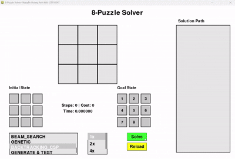
> 
   
### 📊 Thuật toán GenerateE & Test  
> Tránh các thất bại, bằng kiểm tra trước các ràng buộc.Kiểm tra tiến: mỗi khi một biến được gán giá trị (Generate), kiểm tra tiến đảm bảo tính tương thích (consistency) giữa biến đang được xét và các biến chưa được gán nhưng có ràng buộc trực tiếp với nó. Nếu bất kỳ biến nào trong số đó không còn giá trị hợp lệ nào trong miền giá trị, ta quay lui (backtrack).
> 

>   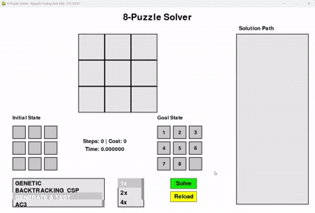
> 
  
### 📊 Thuật toán AC-3  
> AC3 xử lý để lọc bỏ các giá trị không hợp lệ khỏi miền giá trị của biến, dựa trên các ràng buộc giữa các biến kết hợp với Backtracking giúp loc miền giá trị sao mõi bước gán.
> 

>   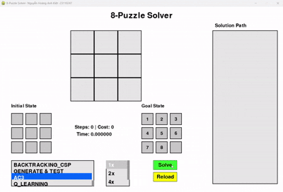
> 
 
### 2.6. Các thuật toán Tìm kiếm học tăng cường  
    - Mô tả: Reinforcement Learning (Học tăng cường) là một kỹ thuật Machine Learning tập trung vào việc đào tạo các tác nhân tự động (agents) đưa ra quyết định thông qua tương tác trực tiếp với môi trường.
    - Thành phần chính: ma trận đầu vào, ma trận dích, hàm training, bảng Q
    - Solutinon:  trả về tập các trạng thái di chuyển từ bắt đầu đến đích  
### 📊 Thuật toán Q-Learning  
> Q-learning giúp agent (tác nhân) học cách hành động tối ưu trong môi trường để đạt phần thưởng tối đa. Không cần biết trước mô hình môi trường.Dựa vào bảng Q (Q-table), trong đó mỗi trạng thái và hành động được gán một giá trị Q.
> 

>   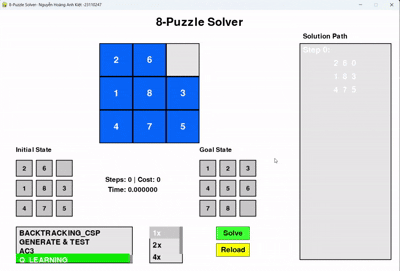
> 
 

### Kết luận  

- Kết quả:

| Thuật toán | Làm được | Chưa làm được |Phân vân| Ghi chú                |
|------------|----------|---------------|--------|------------------------|
|   BFS      |     ✅   |            |     |                        |
|   DFS      |     ✅   |           |      |                        |
|   IDS      |     ✅   |            |      |                        |
|   UCS      |     ✅   |           |      |                        |
|   GREEGY   |     ✅   |            |      |                        |
|   A*       |     ✅   |            |      |                        |
|   IDA*      |     ✅   |            |      |                        |
|   Simple Hill |     ✅   |            |      |                        |
|   Stpest Hill|     ✅   |            |      |                        |
|   Stochastic Hill|     ✅   |            |      |                        |
|   And-Or    |      |      ❌      |      | Không thể áp dụng được trong môi trường niềm tin như yêu cầu, hiểu được một phần thuật toán nhưng chưa biết cách áp dụng vào trò chơi 8 puzzle 1 cách chính xác nhất. |
|   Partial Observation |        |            |   ❓   | Đã cài đặt thuật toán vào trò chơi như mô tả, bài tập trên lớp, nhưng không rõ đã áp dụng đúng bản chất thuật toán vào trò chơi chưa |
|  No Observation|       |            |   ❓   | Tương tự Partial Observation nhưng khác nhau tập Belied_state, khi không có bất cứ không tin gì của trạng thái thực tế, tài liệu có ghi khi áp dụng vào trò chơi 8 Puzzle thì không khả thi|
|   BACKTRACKING     |     ✅   |            |      |                        |
|    GENERATE & TEST     |     ✅   |            |      |                        |
|   AC3     |        |            |   ❓   | Áp dụng kết hợp Backtracking, không chắc vì thấy kết quả chạy giống nhau|
|  Q-Learning  |     ✅   |            |      |                        |

### Tài liệu tham khảo:  
- Một số các khái niệm, lí thuyết về nhóm thuật toán Local Search được lấy và dịch lại từ trang GeeksForGreeks  
    Link: https://www.geeksforgeeks.org/  
- Sách: Russell 2020 Artificial intelligence a modern approach
 
    

