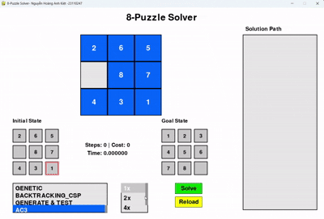

# Do_an_ca_nhan_AI-Nguyễn Hoàng Anh Kiệt-23110247
1.Mục tiêu  
- Hiểu rõ được bản chất và nguyên lí các thuật toán tìm kiếm AI
- Áp dụng được các thuật toán đã học vào vấn đề thực tế (áp dụng thuật toán, tạo giao diện cho trò chơi 8 Puzzle)
- So sánh, đánh giá ưu nhược điểm của từng (nhóm) thuật toán
- Có thể đưa ra giải pháp nâng cấp(nếu có)
2. Nội dung   
  2.1. Các thuật toán Tìm kiếm không có thông tin
     - Thành phần chính: ma trận đầu vào, ma trận đầu ra, thuật toán áp dụng, tập các hành động sinh trạng thái mới
     - Solution: tập các trạng thái mới được sinh ra đại diện cho từng bước giải trò chơi
> 📊 Thuật toán BFS: tìm kiếm bằng cách duyệt theo chiều rộng(duyệt từng lớp) các trạng thái được sinh ra
> 

>   
> 

> 📊 Thuật toán DFS: duyệt theo chiều sâu, duyệt cho tới cuối nhánh của không gian trạng thái
> 

>   
> 

> 📊 Thuật toán IDS: sử dụng DfS nhưng có giới hạn dộ sâu -> tối ưu hơn về mặc thời gian và hiệu suất
> 

>   
> 

> 📊 Thuật toán UCS: duyệt theo tổng chi phí đường đi (là 1 tương ứng với mỗi step
> 

>   
> 
  
    2.2. Các thuật toán Tìm kiếm có thông tin  
     - Thành phần chính: ma trận đầu vào, ma trận đầu ra, thuật toán áp dụng, tập các hành động sinh trạng thái mới
     - Solution: tập các trạng thái mới được sinh ra đại diện cho từng bước giải trò chơi
>  📊 Thuật toán GREEDY: dựa vào chi phí Heurictic (cụ thể là Manhatan được dùng trong mã nguồn) thấp nhất để đưa ra hành động
> 

>   
> 
 
>  📊 Thuật toán A*: dựa vào chi phí g(n): chi phí thực tế (tương ứng với step trong trạng thái hiện tại của curent_state) và h(n): heurictic để xác định trạng thái cần mở rộng
> 

>   
> 
  
> 📊 Thuật toán IDA*: tương tự A*, nhưng có thiết lập chiều sâu, tối ưu hơn về vùng nhớ, hiệu năng tìm kiếm, thuật toán sẽ luôn tìm thấy lời giải nếu có tồn tại
> 

>   
> 
  
    2.3. Các thuật toán Tìm kiếm cục bộ  
> 📊 Thuật toán SIMPLE HILL
> 

>   
> 
  
> 📊 Thuật toán STEPEST HILL
> 

>   
> 
 
>  📊 Thuật toán STOCHASTIC HILL
> 

>   
> 
  
>  📊 Thuật toán SIMULATED_ANNEALING
> 

>   
> 
 
>  📊 Thuật toán BEAM Search
> 

>   
> 
  
>  📊 Thuật toán GENETIC
> 

>   
> 
 
    2.4. Các thuật toán Tìm kiếm trong môi trường phức tạp  
>  📊 Thuật toán Non Observation
> 

>   
> 
  
>  📊 Thuật toán Partial Observation
> 

>   
> 
 
    2.5. Các thuật toán Tìm kiếm có ràng buộc  
>  📊 Thuật toán Backtracking
> 

>   
> 
   
>  📊 Thuật toán GenerateE & Test
> 

>   
> 
  
>  📊 Thuật toán AC-3
> 

>   
> 
 
    

